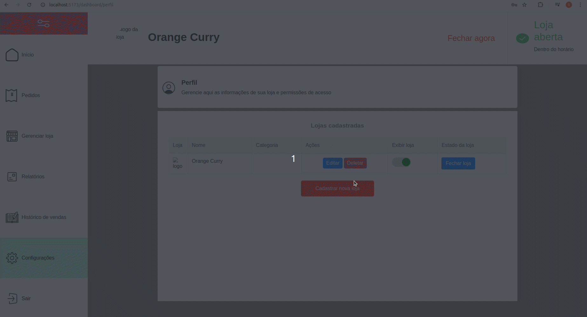

#   Merchant Project - Delivery Application  

## üåê [](https://github.com/SamuelRocha91/seller_application/blob/main/README.md) [](https://github.com/SamuelRocha91/seller_application/blob/main/README_es.md) [](https://github.com/SamuelRocha91/seller_application/blob/main/README_en.md) [](https://github.com/SamuelRocha91/seller_application/blob/main/README_ru.md) [](https://github.com/SamuelRocha91/seller_application/blob/main/README_ch.md) [](https://github.com/SamuelRocha91/seller_application/blob/main/README_ar.md)

This repository contains the merchant application for the delivery platform, developed using Vue.js. This application provides an interface for managing orders and products by merchants.



## Related Repositories

- 💎 [Delivery Application](https://github.com/SamuelRocha91/delivery_back) - Backend in Rails for the delivery application.
- 🛒 [Consumer Application](https://github.com/SamuelRocha91/consumy) - Consumer application.
- 💲 [Paymenty API](https://github.com/SamuelRocha91/paymenty)


**Project Links:**

- [Design on Figma](https://www.figma.com/file/tS8r4eROXBknYixtDcijXd/Meu-portf%C3%B3lio?type=design&node-id=0-1&mode=design&t=pL6yJYx6lOSWBGdw-0)

## Dependencies and Features

### Main Dependencies

- **Vue.js:** Progressive JavaScript framework for building interfaces.
- **Vue Router:** For page routing in Vue.js.
- **Vite:** Build tool for fast and optimized development.
- **Vitest:** Unit testing framework for Vue.js.
- **ESLint & Prettier:** Linting and code formatting tools to maintain code quality.
- **TypeScript:** TypeScript support for safer and more scalable development.
- **Pinia:** State management library inspired by Vuex.

### Implemented Features

- **Fetch Event Source:** For real-time communication with the backend.
- **SweetAlert2:** To display beautiful and customizable alerts and dialogs.
- **Vuedraggable:** For drag-and-drop functionality in the interface.

### Other Tools and Plugins

- **@rails/actioncable:** For integration with WebSockets in the Rails backend.
- **lodash.debounce:** Utility function for facilitating debounce operations.
- **@types/rails__actioncable:** TypeScript typings for ActionCable.

## Project Setup

For integrated usage, follow the steps at:

- [Delivery Backend](https://github.com/SamuelRocha91/delivery_back) - Backend application in Rails for the delivery platform.

To configure and run the repository individually, follow these steps:

### Prerequisites

Make sure you have [Node.js](https://nodejs.org/) and [Yarn](https://classic.yarnpkg.com/lang/en/docs/install/) installed on your machine.

### Installing Dependencies

```sh
npm install
```

### Starting the Development Server

To start the development server, run:

```sh
npm run dev
```

### Running Tests

To run unit tests, use:

```sh
npm run test:unit
```

## Other Projects

- 📏 [React Precision Application](https://github.com/SamuelRocha91/precisionReactApplication/blob/main/README_en.md) - Interface for registering gas and water measurements
- 🤖 [Node API](https://github.com/SamuelRocha91/apiMeasureWaterAndGas/blob/main/README_en.md) - API for measuring and registering consumption of water and gas
