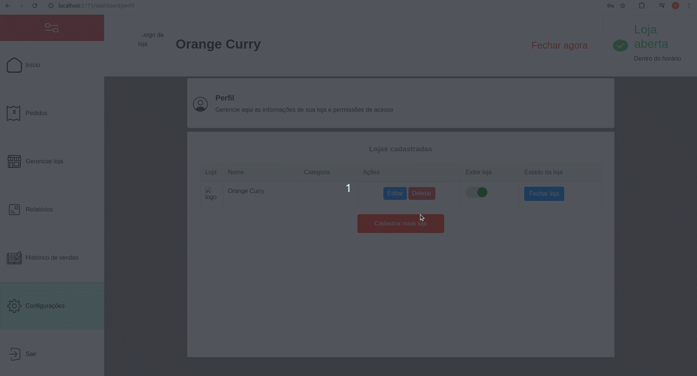

# Проект Продавца - Приложение для Доставки

<h2>🌐</h2>
<ul>
  <li><a href="https://github.com/SamuelRocha91/seller_application" target="_blank">Português</a></li>
  <li><a href="https://github.com/SamuelRocha91/seller_application/blob/main/README_es.md" target="_blank">Español</a></li>
  <li><a href="https://github.com/SamuelRocha91/seller_application/blob/main/README_en.md" target="_blank">English</a></li>
  <li><a href="https://github.com/SamuelRocha91/seller_application/blob/main/README_ru.md" target="_blank">Русский</a></li>
  <li><a href="https://github.com/SamuelRocha91/seller_application/blob/main/README_ch.md" target="_blank">中文</a></li>
  <li><a href="https://github.com/SamuelRocha91/seller_application/blob/main/README_ar.md" target="_blank">العربية</a></li>
</ul>

Этот репозиторий содержит приложение для продавцов для платформы доставки, разработанное на Vue.js. Это приложение предоставляет интерфейс для управления заказами и продуктами продавцами.



## Связанные Репозитории

- [Приложение для Доставки](https://github.com/SamuelRocha91/delivery_back) - Бэкэнд на Rails для приложения доставки.
- [Приложение для Потребителя](https://github.com/SamuelRocha91/consumy) - Приложение для потребителя.


**Ссылки на Проект:**

- [Дизайн в Figma](https://www.figma.com/file/tS8r4eROXBknYixtDcijXd/Meu-portf%C3%B3lio?type=design&node-id=0-1&mode=design&t=pL6yJYx6lOSWBGdw-0)

## Зависимости и Функциональности

### Основные Зависимости

- **Vue.js:** Прогрессивный JavaScript-фреймворк для создания интерфейсов.
- **Vue Router:** Для маршрутизации страниц в Vue.js.
- **Vite:** Инструмент сборки для быстрой и оптимизированной разработки.
- **Vitest:** Фреймворк для юнит-тестирования для Vue.js.
- **ESLint & Prettier:** Инструменты для анализа и форматирования кода для поддержания качества кода.
- **TypeScript:** Поддержка TypeScript для более безопасной и масштабируемой разработки.
- **Pinia:** Библиотека для управления состоянием, вдохновленная Vuex.

### Реализованные Функции

- **Fetch Event Source:** Для реального времени общения с бэкэндом.
- **SweetAlert2:** Для отображения красивых и настраиваемых оповещений и диалогов.
- **Vuedraggable:** Для функции перетаскивания элементов в интерфейсе.

### Другие Инструменты и Плагины

- **@rails/actioncable:** Для интеграции с WebSockets в бэкэнде Rails.
- **lodash.debounce:** Утилита для упрощения операций с debounce.
- **@types/rails__actioncable:** Типы TypeScript для ActionCable.

## Настройка Проекта

Для интегрированного использования следуйте инструкциям:

- [Бэкэнд Доставки](https://github.com/SamuelRocha91/delivery_back) - Бэкэнд на Rails для платформы доставки.

Для настройки и запуска репозитория отдельно следуйте этим шагам:

### Предварительные Требования

Убедитесь, что у вас установлены [Node.js](https://nodejs.org/) и [Yarn](https://classic.yarnpkg.com/lang/en/docs/install/) на вашем компьютере.

### Установка Зависимостей

```sh
npm install
```

### Запуск Серверa Разработки

Чтобы запустить сервер разработки, выполните:

```sh
npm run dev
```

### Запуск Тестов

Чтобы запустить юнит-тесты, используйте:

```sh
npm run test:unit
```

---

Этот проект был создан в рамках оценочного требования для программы Quero Ser Dev 9-го издания от LWSA.

---